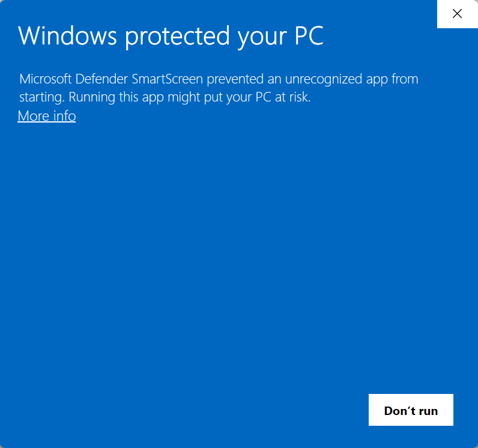
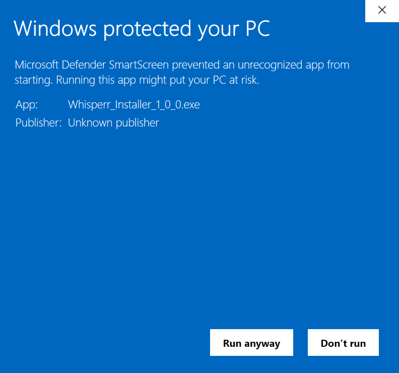

# Whisperr

Whisperr is a CLI tool built using [Typer](https://typer.tiangolo.com/) that converts files or entire directories into a .wav bitstream and back. These streams can also be protected with a password and encrypting the files before conversion.

This process is done through encoding the text of the files into binary and creating a .wav file with those bits. The reverse is done for the decoding proccess.

## Installation

In the releases section, you can download the installer for the latest version. Becuase ths is an independent project and I did not purchase any certificates or sumbit this to Microsoft, Windows will block the installation. You can manually bypass this by clicking "More Info" and then "Run Anways"

<div style="margin: 5px; display: flex; gap: 10px; justify-content: center;">
     
</div>

After running the installer, Whisperr should be able to run globally in your command line.

## Usage

After installing, you can run `whisperr --help` in your command line to see the options and commands. To see the options and arguments for the commands you can run `whisperr <command-name> --help` in the command line.

```bash
C:\Users\UserName> whisperr --help

 Usage: whisperr.exe [OPTIONS] COMMAND [ARGS]...

 Convert text to audio and back.

╭─ Options ─────────────────────────────────────────────────────────────────────────────────────────────────────────────────────────────────────────────────────────────────────────────────────────────────────────────────╮
│ --version             -v        Shows the version of Whisperr                                                                                                                                                             │
│ --install-completion            Install completion for the current shell.                                                                                                                                                 │
│ --show-completion               Show completion for the current shell, to copy it or customize the installation.                                                                                                          │
│ --help                          Show this message and exit.                                                                                                                                                               │
╰───────────────────────────────────────────────────────────────────────────────────────────────────────────────────────────────────────────────────────────────────────────────────────────────────────────────────────────╯
╭─ Commands ────────────────────────────────────────────────────────────────────────────────────────────────────────────────────────────────────────────────────────────────────────────────────────────────────────────────╮
│ encode   Transform a file or directory into a playable .wav bitstream                                                                                                                                                     │
│ decode   Transform a .wav bitstream into a text file.                                                                                                                                                                     │
╰───────────────────────────────────────────────────────────────────────────────────────────────────────────────────────────────────────────────────────────────────────────────────────────────────────────────────────────╯
```

There are two simple commands in Whisperr.

### Encode

Used by running `whisperr encode <src>`. Has options for an output file and to protect the encoded bitstream with a password and encrypting the file(s) before encoding.

```bash
C:\Users\UserName> whisperr encode --help

 Usage: whisperr.exe encode [OPTIONS] SRC

 Transform a file or directory into a playable .wav bitstream

 :param input_file: Description
 :type input_file: Path
 :param output_file: Description
 :type output_file: Path
 :param rate: Description
 :type rate: int

╭─ Arguments ───────────────────────────────────────────────────────────────────────────────────────────────────────────────────────────────────────────────────────────────────────────────────────────────────────────────╮
│ *    src      PATH  The text file to convert. [required]                                                                                                                                                                  │
╰───────────────────────────────────────────────────────────────────────────────────────────────────────────────────────────────────────────────────────────────────────────────────────────────────────────────────────────╯
╭─ Options ─────────────────────────────────────────────────────────────────────────────────────────────────────────────────────────────────────────────────────────────────────────────────────────────────────────────────╮
│ --output   -o      PATH     The destination filepath for the audio file. [default: output.wav]                                                                                                                            │
│ --rate     -r      INTEGER  Sample rate (lower = longer audio) [default: 44100]                                                                                                                                           │
│ --protect  -p               Encrypt your files before encoding and protect it with a password.                                                                                                                            │
│ --help                      Show this message and exit.                                                                                                                                                                   │
╰───────────────────────────────────────────────────────────────────────────────────────────────────────────────────────────────────────────────────────────────────────────────────────────────────────────────────────────╯
```

### Decode

Used by running `whisperr decode <input_file>`. Has options for an output file and if the file is protected, will prompt you with a password before decoding begins.

```bash
C:\Users\UserName> whisperr decode --help

 Usage: whisperr.exe decode [OPTIONS] INPUT_FILE

 Transform a .wav bitstream into a text file.

 :param input_file: Description
 :type input_file: Path
 :param output_file: Description
 :type output_file: Path

╭─ Arguments ───────────────────────────────────────────────────────────────────────────────────────────────────────────────────────────────────────────────────────────────────────────────────────────────────────────────╮
│ *    input_file      PATH  The .wav file to decode. [required]                                                                                                                                                            │
╰───────────────────────────────────────────────────────────────────────────────────────────────────────────────────────────────────────────────────────────────────────────────────────────────────────────────────────────╯
╭─ Options ─────────────────────────────────────────────────────────────────────────────────────────────────────────────────────────────────────────────────────────────────────────────────────────────────────────────────╮
│ --output  -o      PATH  The destination filepath for the text file. [default: recovered]                                                                                                                                  │
│ --help                  Show this message and exit.                                                                                                                                                                       │
╰───────────────────────────────────────────────────────────────────────────────────────────────────────────────────────────────────────────────────────────────────────────────────────────────────────────────────────────╯
```

## Contributing

Pull requests are welcome. For major changes, please open an issue first to discuss what you would like to change.

Please feel free to reccommend features as well, I would love to continue to add to this project.

## License

[MIT](https://choosealicense.com/licenses/mit/)
